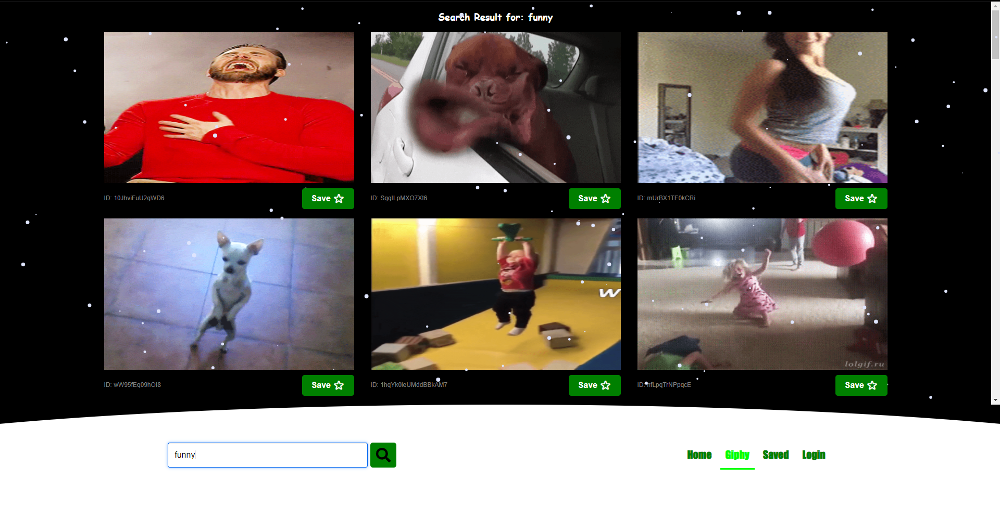

### *Name: Chanyu C.*

## Project: CMP464 Web Development
#### Professor: Professor Cameron Flowers
#### Project Name: Project 2 (Final)

## Description:

The goal of the site is to allow you to personalize,
and save your favorite gif into one place.

- Used an npm libraries: react-snowfall
- Used react redux for global states
- Used express.js for server side api
- Used API to fetch data from public servers
- Multiple pages rendering with react-router
- Javascript Event handling onclick, keydown
- Component lifecycling with ComponentDidMount

#### Deployed Site: https://cchanyu.github.io/HWSubmission/

## Pictures:
